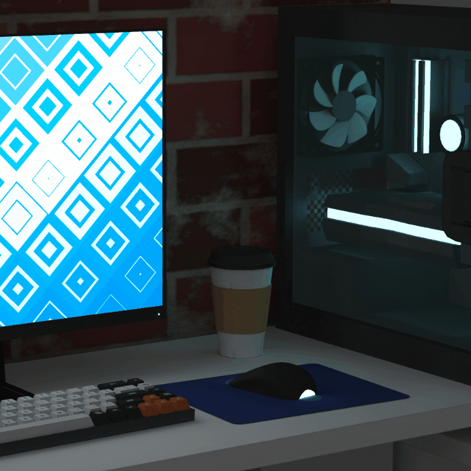

<h1 align="center"> &lt;MalissaAdams.dev /&gt; </h1>
<h3 align="center"> Malissa Adams // 3D Portfolio </h3>

 
  

<!-- TABLE OF CONTENTS -->
<h2 id="contents"> :book: Contents</h2>

  
Contents

  <ol>
    <li><a href="#about-the-project"> ➤ About The Project</a></li>
    <li><a href="#overview"> ➤ Overview</a></li>
    <li><a href="#getting-started"> ➤ Getting Started</a></li>
    <li><a href="#credits"> ➤ Credits</a></li>
    <li><a href="#contact"> ➤ Contact</a></li>
  </ol>

<!-- ABOUT THE PROJECT -->
<h2 id="about-the-project"> :pencil: About The Project</h2>

 
  <b>Malissa Adams</b> is a digital portfolio and resume containing a collection of projects, examples of produced blog and personal information.      

<!-- OVERVIEW -->
<h2 id="overview"> :cloud: Overview</h2>

 
  The project uses an omptimised GLTF scene, created in Blender, which uses a low poly count and baked textures for performance. With react-three-fiber, the scene is injected into the application, which is then overlayed with standard react components to create the experience. This website was my first fully-fledged three.js and react application and was intended to be a learning experiment.

<!-- GETTING STARTED -->
<h2 id="getting-started"> :book: Getting Started</h2>

In the project directory, you can run:

<pre><code>$ npm start</code></pre>

  Runs the app in the development mode. Open <a href="http://localhost:3000">http://localhost:3000</a> to view it in your browser.

<pre><code>$ npm run build</code></pre>

  Builds the app for production to the `build` folder. It correctly bundles React in production mode and optimizes the build for the best performance.

<!-- CREDITS -->
<h2 id="credits"> :scroll: Credits</h2>

Malissa Adams

Acknowledgements:

<ul>
  <li>threejs journey, by Bruno Simon, <a href="https://threejs-journey.com/">https://threejs-journey.com/</a></li>
  <li>Three.js contributors, <a href="https://threejs.org/">https://threejs.org/</a></li>
  <li>pmndrs/drei, by Poimandres <a href="https://github.com/pmndrs/drei/">https://github.com/pmndrs/drei/</a></li>
  <li>Blake Simpson (https://github.com/blakesimpson-dev)</li>

</ul>

<!-- CONTACT -->
<h2 id="contact"> :email: Contact</h2>

<a href="mailto:madams@stantonadams.com">madams@stantonadams.com</a>

 Web3Teacher#8576

 
  

# MalissaAdamsPortfolio
# MalissaAdamsPortfolio
